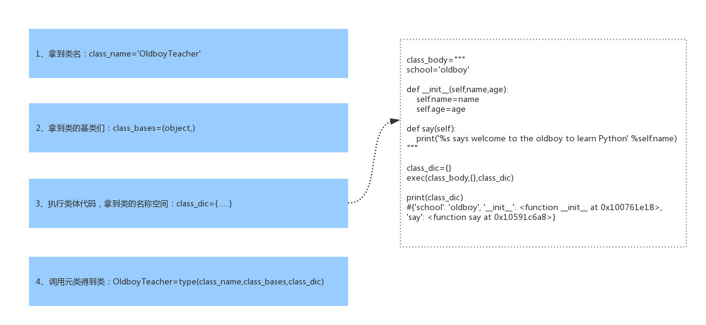

# 一、引言

- 元类属于python面向对象编程的深层魔法，99%的人都不得要领，一些自以为搞明白元类的人其实也只是自圆其说、点到为止，从对元类的控制上来看就破绽百出、逻辑混乱，今天我就来带大家来深度了解python元类的来龙去脉。
- 笔者深入浅出的背后是对技术一日复一日的执念，希望可以大家可以尊重原创，为大家能因此文而解开对元类所有的疑惑而感到开心！！！

# 二、什么是元类

- 在python中一切皆对象，那么我们用class关键字定义的类本身也是一个对象，负责产生该对象的类称之为元类，即元类可以简称为类的类

```python
class Foo:  # Foo=元类()
    pass
```


# 三、为什么用元类

- 元类是负责产生类的，所以我们学习元类或者自定义元类的目的：是为了控制类的产生过程，还可以控制对象的产生过程

# 四、内置函数exec(储备)

```python
cmd = """
x=1
print('exec函数运行了')
def func(self):
    pass
"""
class_dic = {}
# 执行cmd中的代码，然后把产生的名字丢入class_dic字典中
exec(cmd, {}, class_dic)
exec函数运行了
print(class_dic)
{'x': 1, 'func': <function func at 0x10a0bc048>}
```

# 五、class创建类

- 如果说类也是对象，那么用class关键字的去创建类的过程也是一个实例化的过程，该实例化的目的是为了得到一个类，调用的是元类
- 用class关键字创建一个类，用的默认的元类type，因此以前说不要用type作为类别判断

```python
class People:  # People=type(...)
    country = 'China'

    def __init__(self, name, age):
        self.name = name
        self.age = age

    def eat(self):
        print('%s is eating' % self.name)
print(type(People))
<class 'type'>
```



## 5.1 type实现

- 创建类的3个要素：类名，基类，类的名称空间
- People = type(类名，基类，类的名称空间)

```python
class_name = 'People'  # 类名

class_bases = (object, )  # 基类

# 类的名称空间
class_dic = {}
class_body = """
country='China'
def __init__(self,name,age):
    self.name=name
    self.age=age
def eat(self):
    print('%s is eating' %self.name)
"""

exec(
    class_body,
    {},
    class_dic,
)
print(class_name)
People
print(class_bases)
(<class 'object'>,)
print(class_dic)  # 类的名称空间
{'country': 'China', '__init__': <function __init__ at 0x10a0bc048>, 'eat': <function eat at 0x10a0bcd08>}
```

- People = type(类名，基类，类的名称空间)

```python
People1 = type(class_name, class_bases, class_dic)
print(People1)
<class '__main__.People'>
obj1 = People1('alex', 2)
obj1.eat()
alex is eating
```

- class创建的类的调用

```python
print(People)
<class '__main__.People'>
obj = People1('alex', 2)
obj.eat()
alex is eating
```

# 六、自定义元类控制类的创建

- 使用自定义的元类

```python
class Mymeta(type):  # 只有继承了type类才能称之为一个元类，否则就是一个普通的自定义类
    def __init__(self, class_name, class_bases, class_dic):
        print('self:', self)  # 现在是People
        print('class_name:', class_name)
        print('class_bases:', class_bases)
        print('class_dic:', class_dic)
        super(Mymeta, self).__init__(class_name, class_bases,
                                     class_dic)  # 重用父类type的功能
```

- 分析用class自定义类的运行原理（而非元类的的运行原理）：
  1. 拿到一个字符串格式的类名class_name=’People’
  2. 拿到一个类的基类们class_bases=(obejct,)
  3. 执行类体代码，拿到一个类的名称空间class_dic={…}
  4. 调用People=type(class_name,class_bases,class_dic)

```python
class People(object, metaclass=Mymeta):  # People=Mymeta(类名,基类们,类的名称空间)
    country = 'China'

    def __init__(self, name, age):
        self.name = name
        self.age = age

    def eat(self):
        print('%s is eating' % self.name)
self: <class '__main__.People'>
class_name: People
class_bases: (<class 'object'>,)
class_dic: {'__module__': '__main__', '__qualname__': 'People', 'country': 'China', '__init__': <function People.__init__ at 0x10a0bcbf8>, 'eat': <function People.eat at 0x10a0bc2f0>}
```

## 6.1 应用

- 自定义元类控制类的产生过程，类的产生过程其实就是元类的调用过程
- 我们可以控制类必须有文档，可以使用如下的方式实现

```python
class Mymeta(type):  # 只有继承了type类才能称之为一个元类，否则就是一个普通的自定义类
    def __init__(self, class_name, class_bases, class_dic):
        if class_dic.get('__doc__') is None or len(
                class_dic.get('__doc__').strip()) == 0:
            raise TypeError('类中必须有文档注释，并且文档注释不能为空')
        if not class_name.istitle():
            raise TypeError('类名首字母必须大写')
        super(Mymeta, self).__init__(class_name, class_bases,
                                     class_dic)  # 重用父类的功能
try:

    class People(object, metaclass=Mymeta
                 ):  #People  = Mymeta('People',(object,),{....})
        #     """这是People类"""
        country = 'China'

        def __init__(self, name, age):
            self.name = name
            self.age = age

        def eat(self):
            print('%s is eating' % self.name)
except Exception as e:
    print(e)
类中必须有文档注释，并且文档注释不能为空
```

# 七、**call**(储备)

- 要想让obj这个对象变成一个可调用的对象，需要在该对象的类中定义一个方法、、**call**方法，该方法会在调用对象时自动触发

```python
class Foo:
    def __call__(self, *args, **kwargs):
        print(args)
        print(kwargs)
        print('__call__实现了，实例化对象可以加括号调用了')


obj = Foo()
obj('lqz', age=18)
('lqz',)
{'age': 18}
__call__实现了，实例化对象可以加括号调用了
```

# 八、**new**(储备)

我们之前说类实例化第一个调用的是**init**，但**init**其实不是实例化一个类的时候第一个被调用 的方法。当使用 Persion(name, age) 这样的表达式来实例化一个类时，最先被调用的方法 其实是 **new** 方法。

**new**方法接受的参数虽然也是和**init**一样，但**init**是在类实例创建之后调用，而 **new**方法正是创建这个类实例的方法。

注意：***\*new\**() 函数只能用于从object继承的新式类。**

```python
class A:
    pass


class B(A):
    def __new__(cls):
        print("__new__方法被执行")
        return cls.__new__(cls)

    def __init__(self):
        print("__init__方法被执行")


b = B()
```

# 九、自定义元类控制类的实例化

```python
class Mymeta(type):
    def __call__(self, *args, **kwargs):
        print(self)  # self是People
        print(args)  # args = ('lqz',)
        print(kwargs)  # kwargs = {'age':18}
        # return 123
        # 1. 先造出一个People的空对象，申请内存空间
        # __new__方法接受的参数虽然也是和__init__一样，但__init__是在类实例创建之后调用，而 __new__方法正是创建这个类实例的方法。
        obj = self.__new__(self)  # 虽然和下面同样是People，但是People没有，找到的__new__是父类的
        # 2. 为该对空对象初始化独有的属性
        self.__init__(obj, *args, **kwargs)
        # 3. 返回一个初始化好的对象
        return obj
```

- People = Mymeta()，People()则会触发**call**

```python
class People(object, metaclass=Mymeta):
    country = 'China'

    def __init__(self, name, age):
        self.name = name
        self.age = age

    def eat(self):
        print('%s is eating' % self.name)


#     在调用Mymeta的__call__的时候，首先会找自己（如下函数）的，自己的没有才会找父类的
#     def __new__(cls, *args, **kwargs):
#         # print(cls)  # cls是People
#         # cls.__new__(cls) # 错误，无限死循环，自己找自己的，会无限递归
#         obj = super(People, cls).__new__(cls)  # 使用父类的，则是去父类中找__new__
#         return obj
```

- 类的调用，即类实例化就是元类的调用过程，可以通过元类Mymeta的**call**方法控制
- 分析：调用Pepole的目的
  1. 先造出一个People的空对象
  2. 为该对空对象初始化独有的属性
  3. 返回一个初始化好的对象

```python
obj = People('lqz', age=18)
<class '__main__.People'>
('lqz',)
{'age': 18}
print(obj.__dict__)
{'name': 'lqz', 'age': 18}
```

# 一十、自定义元类后类的继承顺序

结合python继承的实现原理+元类重新看属性的查找应该是什么样子呢？？？

在学习完元类后，其实我们用class自定义的类也全都是对象（包括object类本身也是元类type的 一个实例，可以用type(object)查看），我们学习过继承的实现原理，如果把类当成对象去看，将下述继承应该说成是：对象OldboyTeacher继承对象Foo，对象Foo继承对象Bar，对象Bar继承对象object

```python
class Mymeta(type):  # 只有继承了type类才能称之为一个元类，否则就是一个普通的自定义类
    n = 444

    def __call__(self, *args,
                 **kwargs):  #self=<class '__main__.OldboyTeacher'>
        obj = self.__new__(self)
        self.__init__(obj, *args, **kwargs)
        return obj


class Bar(object):
    n = 333


class Foo(Bar):
    n = 222


class OldboyTeacher(Foo, metaclass=Mymeta):
    n = 111

    school = 'oldboy'

    def __init__(self, name, age):
        self.name = name
        self.age = age

    def say(self):
        print('%s says welcome to the oldboy to learn Python' % self.name)


print(
    OldboyTeacher.n
)  # 自下而上依次注释各个类中的n=xxx，然后重新运行程序，发现n的查找顺序为OldboyTeacher->Foo->Bar->object->Mymeta->type
111
print(OldboyTeacher.n)
111
```

- 查找顺序：
  1. 先对象层：OldoyTeacher->Foo->Bar->object
  2. 然后元类层：Mymeta->type

依据上述总结，我们来分析下元类Mymeta中**call**里的self.**new**的查找

```python
class Mymeta(type):
    n = 444

    def __call__(self, *args,
                 **kwargs):  #self=<class '__main__.OldboyTeacher'>
        obj = self.__new__(self)
        print(self.__new__ is object.__new__)  #True


class Bar(object):
    n = 333

    # def __new__(cls, *args, **kwargs):
    #     print('Bar.__new__')


class Foo(Bar):
    n = 222

    # def __new__(cls, *args, **kwargs):
    #     print('Foo.__new__')


class OldboyTeacher(Foo, metaclass=Mymeta):
    n = 111

    school = 'oldboy'

    def __init__(self, name, age):
        self.name = name
        self.age = age

    def say(self):
        print('%s says welcome to the oldboy to learn Python' % self.name)

    # def __new__(cls, *args, **kwargs):
    #     print('OldboyTeacher.__new__')


OldboyTeacher('lqz',
              18)  # 触发OldboyTeacher的类中的__call__方法的执行，进而执行self.__new__开始查找
```

总结，Mymeta下的**call**里的self.**new**在OldboyTeacher、Foo、Bar里都没有找到**new**的情况下，会去找object里的**new**，而object下默认就有一个**new**，所以即便是之前的类均未实现**new**,也一定会在object中找到一个，根本不会、也根本没必要再去找元类Mymeta->type中查找**new**

# 十一、练习

需求：使用元类修改属性为隐藏属性

```python
class Mymeta(type):
    def __init__(self, class_name, class_bases, class_dic):
        # 加上逻辑，控制类Foo的创建
        super(Mymeta, self).__init__(class_name, class_bases, class_dic)

    def __call__(self, *args, **kwargs):
        # 加上逻辑，控制Foo的调用过程，即Foo对象的产生过程
        obj = self.__new__(self)
        self.__init__(obj, *args, **kwargs)
        # 修改属性为隐藏属性
        obj.__dict__ = {
            '_%s__%s' % (self.__name__, k): v
            for k, v in obj.__dict__.items()
        }

        return obj
class Foo(object, metaclass=Mymeta):  # Foo = Mymeta(...)
    def __init__(self, name, age, sex):
        self.name = name
        self.age = age
        self.sex = sex


obj = Foo('lqz', 18, 'male')
print(obj.__dict__)
{'_Foo__name': 'egon', '_Foo__age': 18, '_Foo__sex': 'male'}
```