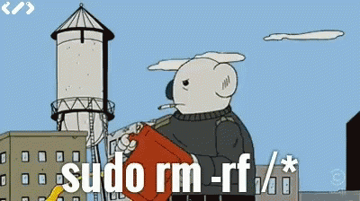

# 一、**del**

- **del**也称之为析构方法
- **del**会在对象被删除之前自动触发



```python
class People:
    def __init__(self, name, age):
        self.name = name
        self.age = age
        self.f = open('test.txt', 'w', encoding='utf-8')

    def __del__(self):
        print('run======>')
        # 做回收系统资源相关的事情
        self.f.close()


obj = People('egon', 18)
del obj  # del obj会间接删除f的内存占用，但是还需要自定制__del__删除文件的系统占用
print('主')

run=-====>
主
```